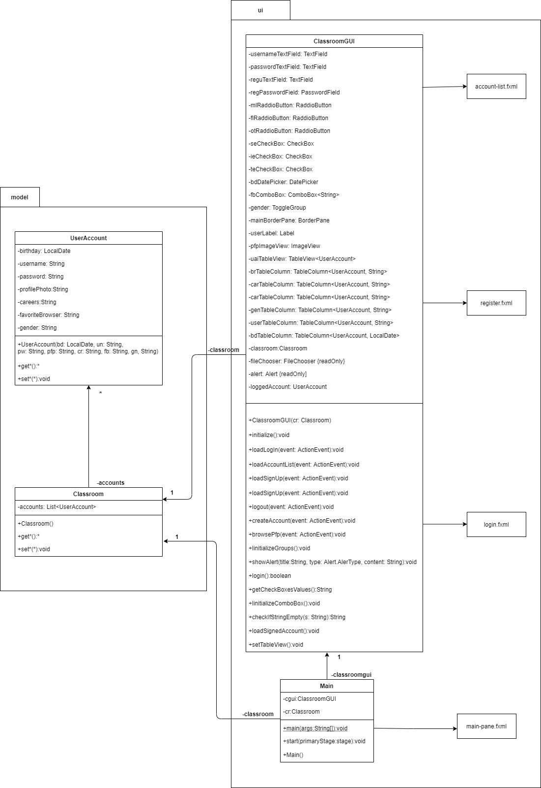

# login-and-user-accounts

please, first read the repository's about.

The compiled code is inside *.idea* since this was made using Intellij Idea. 

The enunciate for this project was the next: 

The teacher of a subject that you're currently studying wants to know general information about each one of his students to generate stadistics and has asked you to develop a program with graphical user interface that allows to *log in* to see the listing of accounts with their information. If a person that wants to log in doesn't have an user account, that person can create it through the Sign Up option.

